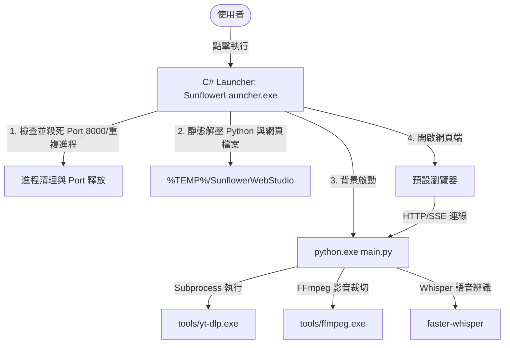

# YoutubeGrabber - 開發者與編譯指南 🌻

本專案為 **Youtube 擷取與編輯工具**，採用 **「C# 啟動器外殼 + 外置 Python Flask 背景伺服器 + 靜態網頁前端」** 的三層混合架構。本文件旨在協助開發者理解本機開發設定與重新編譯啟動器的流程。

對於一般使用者的特色說明與使用方法，請參閱：[USER_GUIDE.md](file:///c:/PythonProgram/WedTest/USER_GUIDE.md)。

---

## 🏗️ 系統架構概要



* **C# 啟動器 (`src/SunflowerLauncher.cs`)**：
  * 使用 .NET 4.0 WinForms（無啟動視窗）撰寫，負責程序單一實例（Single Instance）檢查、Port 8000 佔用清理、資源解壓釋放、常駐系統匣（Tray Icon）管理。
  * 啟動後，它會自動呼叫本機 `python.exe` 執行解壓出來的 `main.py` 後端服務。
* **Python Flask 後端 (`src/main.py`)**：
  * 提供 RESTful API 供前端網頁調用。
  * 透過調用外部 `tools/yt-dlp.exe` 與 `tools/ffmpeg.exe` / `tools/ffprobe.exe` 執行高效的影片下載、無損剪輯，並使用 `faster-whisper` 執行本機 AI 語音辨識。
* **前端網頁 (`src/static/`)**：
  * 純 HTML5/Vanilla CSS/Vanilla JS 實現，使用現代磨砂玻璃（Glassmorphism）與向日葵深色主題，提供即時日誌主控台（SSE）與下載進度條。

---

## 🛠️ 開發環境設定

### 1. 系統需求
* Windows 作業系統 (Windows 7 / 10 / 11)
* Python 3.8 ~ 3.12 (建議)
* 已安裝並設定好 C# 編譯器環境（通常 Windows 皆內建 .NET Framework `csc.exe` 編譯器）

### 2. 安裝 Python 依賴套件
在專案根目錄下執行：
```bash
pip install -r requirements.txt
```

### 3. 開發期除錯啟動方式
在進行程式碼修改時，無須每次都進行編譯。您可以直接手動啟動 Python 後端：
```bash
python src/main.py
```
啟動後，直接雙擊 `src/static/index.html` 或訪問 `http://127.0.0.1:8000` 即可在瀏覽器中實時測試前端與後端的交互。

---

## ⚙️ 專案目錄結構

* **`c:\PythonProgram\WedTest\`** (專案根目錄)
  * `SunflowerLauncher.exe` - 編譯出來的最終綠色單一執行檔。
  * `compile_launcher.bat` - 用於編譯 C# 啟動器並打包內嵌資源的批次檔。
  * `requirements.txt` - Python 後端所需依賴庫。
  * `index.html` - 用於 GitHub Pages 首頁重新導向的跳轉檔。
  * **`src/`** - 原始碼資料夾
    * `SunflowerLauncher.cs` - C# 啟動器外殼程式碼。
    * `CreateIcon.cs` - 用於在編譯時動態繪製與導出高解析向日葵 `icon.ico` 的 C# 工具。
    * `main.py` - Flask 本地 Web 伺服器主程式。
    * `youtubeDownload.py` - 封裝 `yt-dlp.exe` 調用與進度百分比解析邏輯。
    * `mediaCut.py` - 調用 `ffmpeg.exe` 執行無損剪輯。
    * `audioProcessor.py` - 調用 Whisper 模型執行語音辨識。
    * **`static/`** - 網頁前端資源
      * `index.html` - 主控台介面。
      * `style.css` - 深色/淺色主題與向日葵視覺系統 CSS。
      * `app.js` - 前端互動邏輯、SSE 日誌串流監聽、拖曳上傳與檔案瀏覽器。

---

## 📦 重新編譯啟動器說明

如果您修改了 `src/` 中的 Python 程式，或是修改了 `src/static/` 中的 HTML、CSS、JS 等前端資源，您必須將其重新封裝進 `SunflowerLauncher.exe`：

1. 確保您的 Windows 系統包含以下路徑的編譯器（批次檔會自動檢測）：
   `C:\Windows\Microsoft.NET\Framework\v4.0.30319\csc.exe`
2. 雙擊執行根目錄下的 **`compile_launcher.bat`**。
3. **編譯三步驟**：
   * **步驟 1/3**：編譯並執行 `CreateIcon.cs`，動態生成高解析的 `icon.ico` 圖示。
   * **步驟 2/3**：調用 `csc.exe` 將 C# 程式碼編譯為 Windows 視窗程式 (`/target:winexe`)，並將所有 Python 腳本與網頁資源作為二進位資源（`/resource`）內嵌封裝進 `SunflowerLauncher.exe`，同時將 `icon.ico` 設為程式的 Win32 外觀圖示。
   * **步驟 3/3**：自動刪除臨時生成的 `icon.ico` 與圖示編譯器，維護目錄整潔。
4. 編譯出的全新 `SunflowerLauncher.exe` 即可獨立攜帶並直接雙擊執行。

---

## 📂 檔案管理與 Git 忽略規則

為了防止不必要的二進位大檔案、下載的影音檔案或編譯暫存檔被提交至 GitHub 儲存庫，`.gitignore` 已嚴格配置排除以下目錄與副檔名：
* **`tools/`**：存放下載的 `ffmpeg.exe`、`ffprobe.exe` 與 `yt-dlp.exe`。
* **媒體與文件檔**：排除所有下載與剪輯出的 `*.mp4`, `*.mp3`, `*.webm`, `*.mkv`, `*.txt` 等。
* **暫存檔案**：排除解壓暫存檔與 uninstallation 旗標檔。